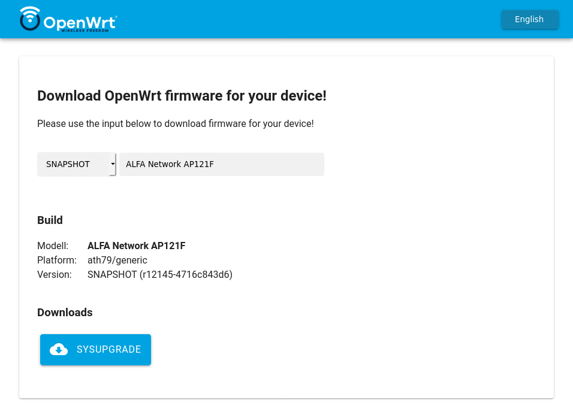

# Attendedsysupgrade Server for OpenWrt (GSoC 2017)

This project intends to simplify the sysupgrade process of devices running
OpenWrt or distributions based on the former like LibreMesh. The provided tools
here offer an easy way to reflash the router with a new version or package
upgrades, without the need of `opkg` installed.

Additionally it offers an API (covered below) to request custom images with any
selection of packages pre-installed, allowing to create firmware images without
the need of setting up a build environment, even from mobile devices.

## Clients

### Yet another firmware selector

Simple web interface using vanilla JavaScript currently developed by @mwarning.
It offers a device search based on model names and show links either to
[official images](https://downloads.openwrt.org/) or requests images via the
_asu_ API. Please join in the development at the [GitHub
repository](https://github.com/mwarning/yet_another_firmware_selector)

### LuCI app

The package
[`luci-app-attendedsysupgrade`](https://github.com/openwrt/luci/tree/master/applications/luci-app-attendedsysupgrade)
offers a simple view under `System > Attended Sysupgrade` to automatically
request a new firmware, wait until it is build and flash it.

## Server

The server listens to image requests and automatically generate them if the
request was valid. This is done by automatically setting up OpenWrt
ImageBuilders and cache images in a Redis database. This allows to quickly
respond to requests without rebuilding existing images again.

### Active server

-   [chef.libremesh.org](https://chef.libremesh.org)

## Run your own server

Redis is required to store image requests:

    sudo apt install redis-server tar

Install _asu_:

    pip install asu

Start the server via the following commands:

    export FLASK_APP=asu  # set Flask app to asu
    flask janitor init    # download upstream profiles/packages
    flask run             # run development server

Start the worker via the following comand:

    rq worker

### Production

It is recommended to run _ASU_ via `gunicorn` proxied by `nginx`. Find a
possible `nginx` configuration in the `misc/` folder. Also the setup should not
HTTPS to allow clients without SSL/certificates to check for upgrades.

To change the default setting place a file called `config.py` in the root of
the [instance
folder](https://flask.palletsprojects.com/en/1.1.x/config/#instance-folders).
Find an example in the `misc/` folder.

    pip install gunicorn
    gunicorn "asu:create_app()"

### Development

After cloning this repository create a Python virtual environment and install
the dependencies:

    python3 -m venv .
    source bin/activate
    pip install -r requirements.txt
    export FLASK_APP=asu  # set Flask app to asu
    export FLASK_DEBUG=1  # run Flask in debug mode (autoreload)
    flask run

## API

### Upgrade check `/api/versions`

The server does no longer offer complex upgrade but only serves static JSON
files including available versions. For now the client must evaluate if the
responded JSON contains a newer version.

### Build request `/api/build`

| key        | value                 | information                              |
| ---------- | --------------------- | ---------------------------------------- |
| `version`  | `SNAPSHOT`            | installed version                        |
| `profile`  | `netgear_wndr4300-v2` | `board_name` of `ubus call system board` |
| `packages` | `["luci", "vim"]`     | Extra packages for the new image         |

Each valid request returns a `request_hash` which can be used for future
polling via `/api/build/<request_hash>`.

### Response `status 200`

A `200` response means the image was sucessfully created. The response is JSON
encoded containing build information.

| key            | information                                 |
| -------------- | ------------------------------------------- |
| `bin_dir`      | relative path to created files              |
| `buildlog`     | boolean if buildlog.txt was created         |
| `manifest`     | dict of all installed packages plus version |
| `request_hash` | hashed request data stored by the server    |

    {
      "build_at": "Tue, 25 Feb 2020 08:49:48 GMT",
      "enqueued_at": "Tue, 25 Feb 2020 08:49:09 GMT",
      "id": "avm_fritzbox-4040",
      "image_prefix": "openwrt-387e9d003d04-ipq40xx-generic-avm_fritzbox-4040",
      "images": [
        {
          "name": "openwrt-387e9d003d04-ipq40xx-generic-avm_fritzbox-4040-squashfs-eva.bin",
          "sha256": "8cb0d58bf672ed442f0813a1f04ec2f5edf6e2b64c8f117cb11158e19251aa0b",
          "type": "eva"
        },
        {
          "name": "openwrt-387e9d003d04-ipq40xx-generic-avm_fritzbox-4040-squashfs-sysupgrade.bin",
          "sha256": "0d12ce60dd63422a63ed28f0e2a2ab2d367a407ccc32b665c28c809f3cb073f1",
          "type": "sysupgrade"
        }
      ],
      "manifest": {
        "ath10k-firmware-qca4019-ct": "2019-10-03-d622d160-1",
        "base-files": "213-r12297-7e9c7e7b2d",
        "busybox": "1.31.1-1",
        "cgi-io": "17",
        "dnsmasq": "2.80-18",
        [...]
        "uclient-fetch": "2020-01-05-fef6d3d3-1",
        "uhttpd": "2020-02-12-2ee323c0-1",
        "urandom-seed": "1.0-1",
        "urngd": "2020-01-21-c7f7b6b6-1",
        "usign": "2019-09-21-f34a383e-1",
        "vim": "8.1-6",
        "wireless-regdb": "2019.06.03",
        "wpad-basic": "2019-08-08-ca8c2bd2-6",
        "zlib": "1.2.11-3"
      },
      "metadata_version": 1,
      "request_hash": "5bac6cb8321f",
      "supported_devices": [
        "avm,fritzbox-4040"
      ],
      "target": "ipq40xx/generic",
      "titles": [
        {
          "model": "FRITZ!Box 4040",
          "vendor": "AVM"
        }
      ],
      "version_commit": "r12297-7e9c7e7b2d",
      "version_number": "SNAPSHOT"
    }

### Response status codes

The client should check the status code:

| status | meaning                              | information                                                        |
| ------ | ------------------------------------ | ------------------------------------------------------------------ |
| `200`  | build finish / upgrade available     | see parameters above                                               |
| `202`  | building, queued, imagebuilder setup | building right now or in build queue                               |
| `400`  | bad request                          | see `error` parameter                                              |
| `404`  | not found                            | if invalid `request_hash` supplied via `/api/build/<request_hash>` |
| `422`  | unknown package                      | unknown package in request                                         |
| `500`  | build failed                         | see `log` for build log                                            |
