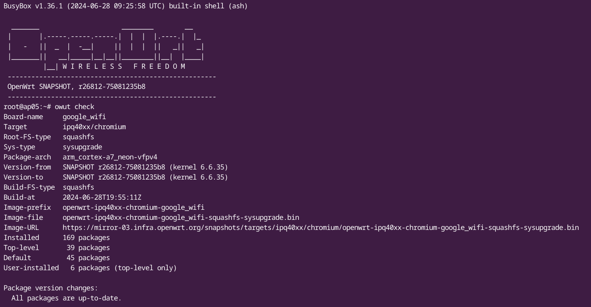

# Attendedsysupgrade Server (GSoC 2017)

This project simplifies the sysupgrade process for upgrading the firmware of
devices running OpenWrt or distributions based on it. These tools offer an easy
way to reflash the router with a new firmware version
(including all packages) without the need to use `opkg`.

ASU is based on an [API](#api) to request custom firmware images with any
selection of packages pre-installed. This avoids the need to set up a build
environment, and makes it possible to create a custom firmware image even using
a mobile device.

## Clients of the Sysupgrade Server

### OpenWrt Firmware Selector

Simple web interface using vanilla JavaScript currently developed by @mwarning.
It offers a device search based on model names and show links either to
[official images](https://downloads.openwrt.org/) or requests images via the
_asu_ API. Please join in the development at
[GitLab repository](https://gitlab.com/openwrt/web/firmware-selector-openwrt-org)

* <https://firmware-selector.openwrt.org>

### LuCI app

The package
[`luci-app-attendedsysupgrade`](https://github.com/openwrt/luci/tree/master/applications/luci-app-attendedsysupgrade)
offers a simple tool under `System > Attended Sysupgrade`. It requests a new
firmware image that includes the current set of packages, waits until it's built
and flashes it. If "Keep Configuration" is checked in the GUI, the device
upgrades to the new firmware without any need to re-enter any configuration or
re-install any packages.

### CLI

With `OpenWrt SNAPSHOT-r26792 or newer` the CLI app `auc` was replaced with [`owut`](https://openwrt.org/docs/guide-user/installation/sysupgrade.owut) as a more comprehensive CLI tool to provide an easy way to upgrade your device.

The [`auc`](https://github.com/openwrt/packages/tree/master/utils/auc) package
performs the same process as the `luci-app-attendedsysupgrade`
from SSH/the command line.

## Server

The server listens for image requests and, if valid, automatically generates
them. It coordinates several OpenWrt ImageBuilders and caches the resulting
images in a Redis database. If an image is cached, the server can provide it
immediately without rebuilding.

### Active server

* [sysupgrade.openwrt.org](https://sysupgrade.openwrt.org)
* Create a pullrequest to add your server here

## Run your own server

For security reasons each build happens inside a container so that one build
can't affect another build. For this to work a Podman container runs an API
service so workers can themselfs execute builds inside containers.

Please install Podman and test if it works:

    podman run --rm -it docker.io/library/alpine:latest

Once Podman works, install `podman-compose`:

    pip install podman-compose

Now it's possible to run all services via `podman-compose`:

    # where to store images and json files
    echo "PUBLIC_PATH=$(pwd)/public" > .env
    # absolute path to podman socket mounted into worker containers
    echo "CONTAINER_SOCK=/run/user/$(id -u)/podman/podman.sock" >> .env
    podman-compose up -d

This will start the server, the Podman API container and two workers. The first
run needs a few minutes since available packages are parsed from the upstream
server. Once the server is running, it's possible to request images via the API
on `http://localhost:8000`. Modify `podman-compose.yml` to change the port.

### Production

For production it's recommended to use a reverse proxy like `nginx` or `caddy`.

#### System requirements

* 2 GB RAM (4 GB recommended)
* 2 CPU cores (4 cores recommended)
* 50 GB disk space (200 GB recommended)

### Development

After cloning this repository, create a Python virtual environment and install
the dependencies:

#### Running the server

    poetry install
    poetry run fastapi dev asu/main.py

#### Running a worker

    # podman unix socket (not path), no need to mount anything
    export CONTAINER_HOST=unix:///run/user/1001/podman/podman.sock
    poetry run rq worker

### API

The API is documented via _OpenAPI_ and can be viewed interactively on the
server:

* [https://sysupgrade.openwrt.org/docs/](https://sysupgrade.openwrt.org/docs/)
* [https://sysupgrade.openwrt.org/redoc](https://sysupgrade.openwrt.org/redoc/)
