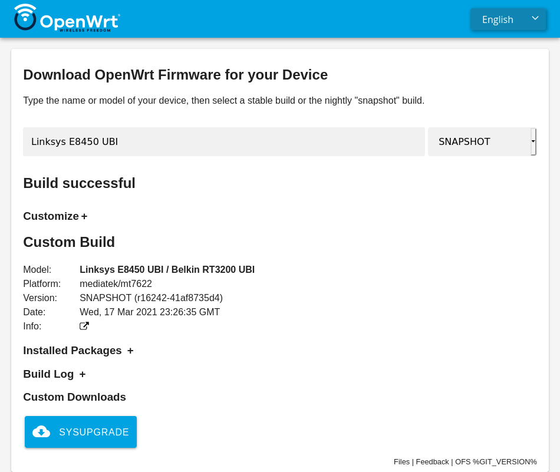
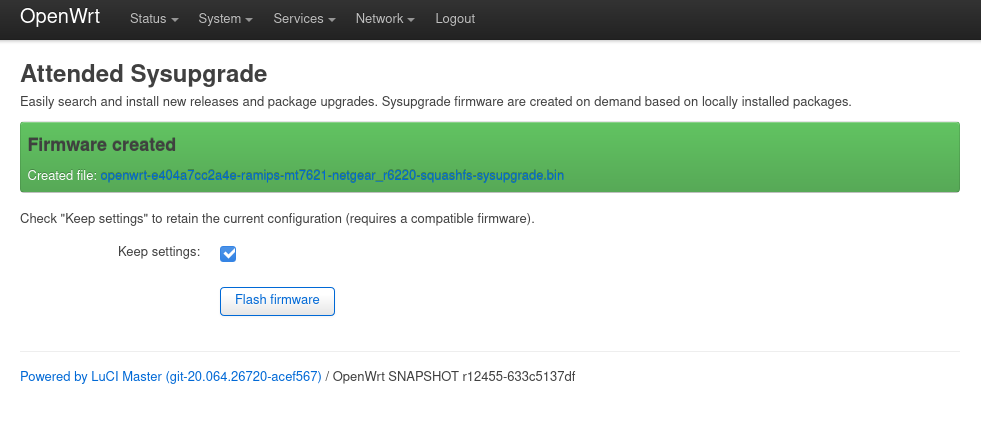
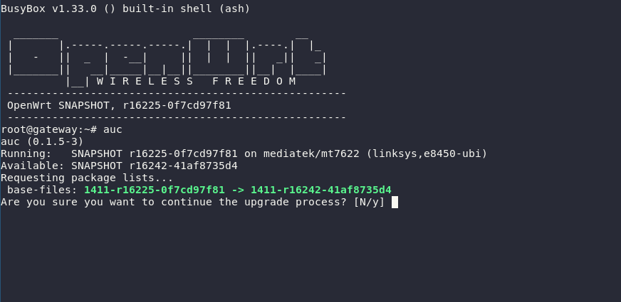

# Attendedsysupgrade Server for OpenWrt (GSoC 2017)

This project intends to simplify the sysupgrade process of devices running
OpenWrt or distributions based on the former like LibreMesh. The provided tools
here offer an easy way to reflash the router with a new version or package
upgrades, without the need of `opkg` installed.

Additionally it offers an API (covered below) to request custom images with any
selection of packages pre-installed, allowing to create firmware images without
the need of setting up a build environment, even from mobile devices.

## Clients

### OpenWrt Firmware Selector

Simple web interface using vanilla JavaScript currently developed by @mwarning.
It offers a device search based on model names and show links either to
[official images](https://downloads.openwrt.org/) or requests images via the
*asu* API. Please join in the development at the [GitLab
repository](https://gitlab.com/openwrt/web/firmware-selector-openwrt-org)

### LuCI app

The package
[`luci-app-attendedsysupgrade`](https://github.com/openwrt/luci/tree/master/applications/luci-app-attendedsysupgrade)
offers a simple view under `System > Attended Sysupgrade` to automatically
request a new firmware, wait until it's built and flash it.

### CLI

It's possible to upgrade routers via a command line interface called
[`auc`](https://github.com/openwrt/packages/tree/master/utils/auc).

## Server

The server listens to image requests and automatically generate them if the
request was valid. This is done by automatically setting up OpenWrt
ImageBuilders and cache images in a Redis database. This allows to quickly
respond to requests without rebuilding existing images again.

### Active server

*   [asu.aparcar.org](https://asu.aparcar.org)
*   ~~[chef.libremesh.org](https://chef.libremesh.org)~~ (This domain will be
    shortly forewarded to the new server.

## Run your own server

Redis is required to store image requests:

    sudo apt install redis-server tar

Install *asu*:

    pip install asu

Start the server via the following commands:

    export FLASK_APP=asu.asu  # set Flask app to asu
    flask janitor update      # download upstream profiles/packages
    flask run                 # run development server

Start the worker via the following comand:

    rq worker

### Docker

Run The service inside multiple Docker containers. The services include the
*ASU* server itself, a *janitor* service which fills the Redis database with
known packages and profiles as well as a `rqworker` which actually builds
images.

Currently all services share the same folder and therefore a very "open" access
is required, suggestions on how to improve this setup are welcome.

	mkdir ./asu-service/
	chmod 777 ./asu-service/
	docker-compose up

A webserver should proxy API calls to port 8000 of the `server` service while
the `asu/` folder should be file hosted as is.

### Production

It is recommended to run *ASU* via `gunicorn` proxied by `nginx` or
`caddyserver`. Find a possible server configurations in the `misc/` folder.

The *ASU* server will try `$PWD/config.py` and `/etc/asu/config.py` to find a
configuration. Find an example configuration in the `misc/` folder.

    pip install gunicorn
    gunicorn "asu.asu:create_app()"

Ideally use the tool `squid` to cache package indexes, which are reloaded every
time an image is build. Find a basic configuration in at `misc/squid.conf`
which should be copied to `/etc/squid/squid.conf`.

If you want to use `systemd` find the service files `asu.service` and
`rqworker.service` in the `misc` folder as well.

### Development

After cloning this repository create a Python virtual environment and install
the dependencies:

    python3 -m venv .direnv
    source .direnv/bin/activate
    pip install -r requirements.txt
    export FLASK_APP=asu.asu  # set Flask app to asu
    export FLASK_DEBUG=1      # run Flask in debug mode (autoreload)
    flask run

## API

The API is documented via *OpenAPI* and can be viewed interactively on the
server:

https://asu.aparcar.org/ui/
