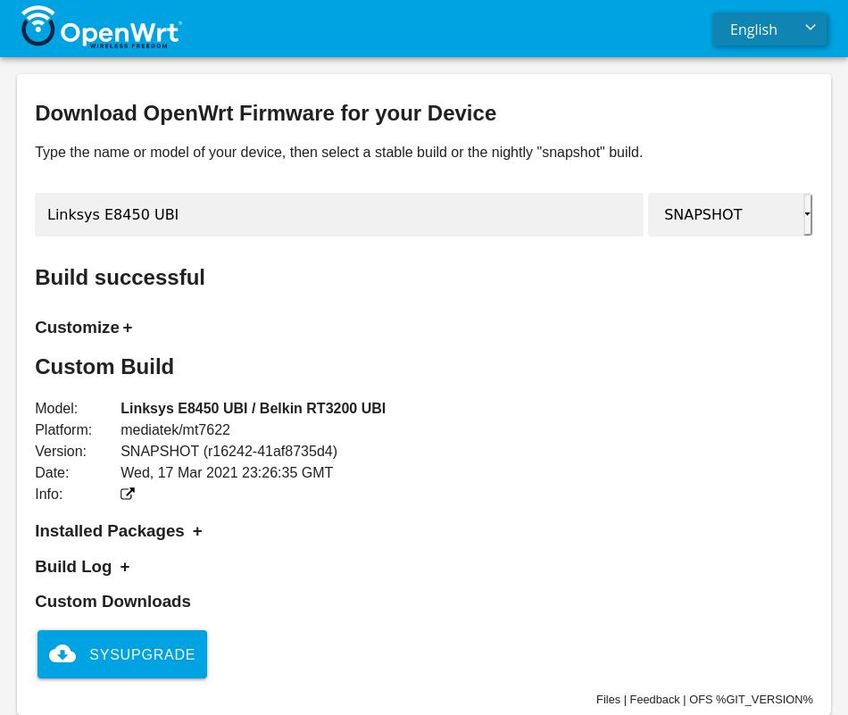
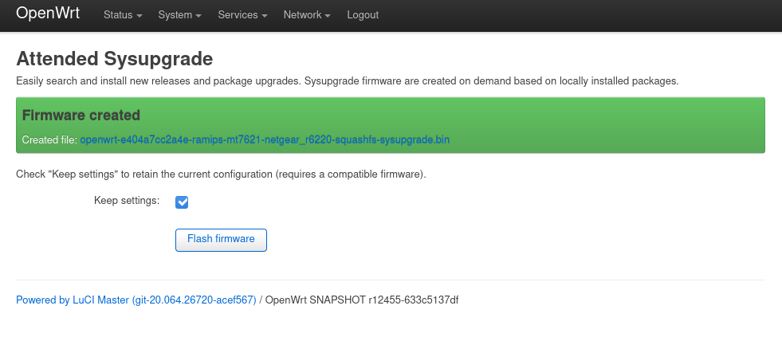
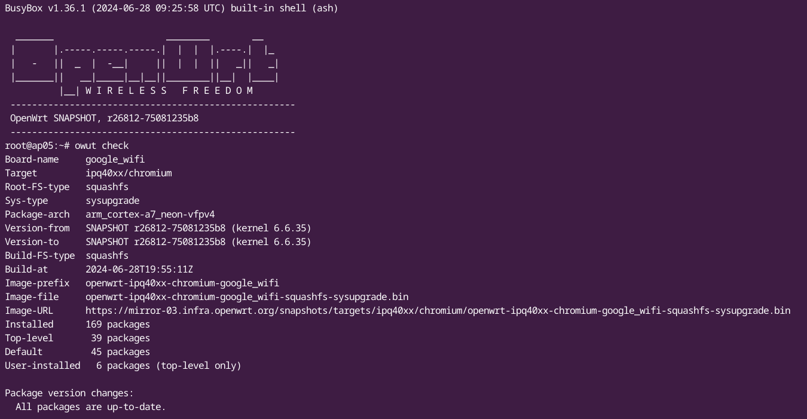

# Attended Sysupgrade Server

[](https://codecov.io/gh/openwrt/asu)

This project simplifies the sysupgrade process for upgrading the firmware of
devices running OpenWrt or distributions based on it. These tools offer an easy
way to reflash the router with a new firmware version (including all packages)
without the need to use `opkg`.

ASU is based on an [API](#api) to request custom firmware images with any
selection of packages pre-installed. This avoids the need to set up a build
environment, and makes it possible to create a custom firmware image even using
a mobile device.

## Clients of the Sysupgrade Server

### OpenWrt Firmware Selector

Simple web interface using vanilla JavaScript currently developed by @mwarning.
It offers a device search based on model names and shows links either to
[official images](https://downloads.openwrt.org/) or requests images via the
_asu_ API. Please join in the development at the
[GitHub repository](https://github.com/openwrt/firmware-selector-openwrt-org).

- <https://firmware-selector.openwrt.org>



### LuCI app

The package
[`luci-app-attendedsysupgrade`](https://github.com/openwrt/luci/tree/master/applications/luci-app-attendedsysupgrade)
offers a simple tool under `System > Attended Sysupgrade`. It requests a new
firmware image that includes the current set of packages, waits until it's built
and flashes it. If "Keep Configuration" is checked in the GUI, the device
upgrades to the new firmware without any need to re-enter any configuration or
re-install any packages.



### CLI

With `OpenWrt SNAPSHOT-r26792 or newer` (and in the 24.10 release) the CLI app
[`auc`](https://github.com/openwrt/packages/tree/master/utils/auc) was replaced
with [`owut`](https://openwrt.org/docs/guide-user/installation/sysupgrade.owut)
as a more comprehensive CLI tool to provide an easy way to upgrade your device.



## Server

The server listens for image requests and, if valid, automatically generates
them. It coordinates several OpenWrt ImageBuilders and caches the resulting
images in a Redis database. If an image is cached, the server can provide it
immediately without rebuilding.

### Active servers

> [!NOTE]
> Official server using ImageBuilder published on [OpenWrt
> Downloads](https://downloads.openwrt.org).

- [sysupgrade.openwrt.org](https://sysupgrade.openwrt.org)

> [!NOTE]
> Unofficial servers, may run modified ImageBuilder

- [ImmortalWrt](https://sysupgrade.kyarucloud.moe)
- [LibreMesh](https://sysupgrade.antennine.org) (only `stable` and `oldstable` OpenWrt versions)
- [sysupgrade.guerra24.net](https://sysupgrade.guerra24.net)
- Create a pull request to add your server here

## Run your own server

For security reasons each build happens inside a container so that one build
can't affect another. A Podman socket is used so workers can execute builds
inside containers.

### Installation

The server uses `podman-compose` to manage the containers. On a Debian based
system, install the following packages:

```bash
sudo apt install podman-compose
```

A [Python library](https://podman-py.readthedocs.io/en/latest/) is used to
communicate with Podman over a socket. Symlink the socket into the project
directory:

```bash
ln -sf /run/user/$(id -u)/podman/podman.sock podman.sock
```

If the Podman socket is not running, enable it:

```bash
systemctl --user enable --now podman.socket
```

Create the isolated network for build containers (no access to Redis or other
services):

```bash
podman network create asu-build
```

Copy the example configuration and adjust as needed:

```bash
cp asu.example.toml asu.toml
```

Now you can either use the latest ASU containers or build them yourself:

```bash
# use existing containers
podman-compose pull

# build containers locally
podman-compose build
```

Start all services:

```bash
podman-compose up -d
```

This will start the server, a Redis instance and one worker. Once running,
the API is available at `http://localhost:8000`. Modify `podman-compose.yml`
to change the port.

#### Optional: caching proxy

To cache upstream package downloads between builds, enable the nginx caching
proxy:

```bash
podman-compose -f podman-compose.yml -f podman-compose.cache.yml up -d
```

Set `cache_url = "http://cache"` in `asu.toml` to route build container
package downloads through the cache.

### Production

For production it's recommended to use a reverse proxy like `nginx` or `caddy`.
You can find a Caddy sample configuration in `misc/Caddyfile`.

If you want your server to remain active after you log out, enable "linger":

```bash
loginctl enable-linger
```

#### System requirements

- 2 GB RAM (4 GB recommended)
- 2 CPU cores (4 cores recommended)
- 50 GB disk space (200 GB recommended)

### Development

After cloning this repository, install `uv` which manages the Python
dependencies.

```bash
# Install uv
curl -LsSf https://astral.sh/uv/install.sh | sh

# Install dependencies
uv sync --extra dev
```

#### Running Redis

```bash
podman run -d --name redis -p 6379:6379 redis:alpine
```

#### Running the server

```bash
uv run fastapi dev asu/main.py
```

#### Running a worker

```bash
uv run rq worker
```

### API

The API is documented via _OpenAPI_ and can be viewed interactively on the
server:

- [https://sysupgrade.openwrt.org/docs/](https://sysupgrade.openwrt.org/docs/)
- [https://sysupgrade.openwrt.org/redoc](https://sysupgrade.openwrt.org/redoc/)
