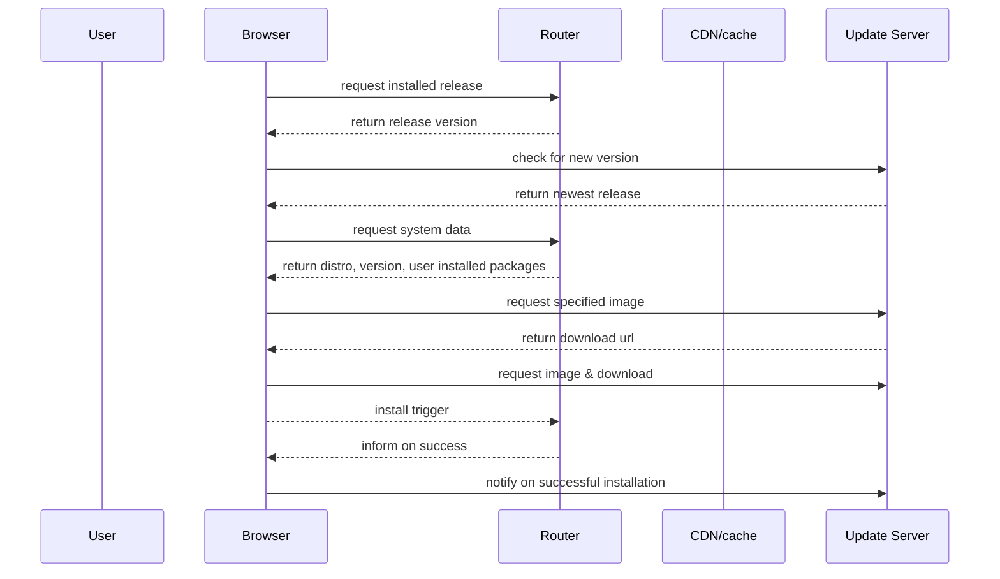

# sequence diagram

#### use https://mdp.tylingsoft.com to render this document

```mermaid
sequenceDiagram
participant User
participant Browser
participant Router
participant CDN/cache
participant Update Server

Browser ->> Router: request installed release
Router -->> Browser: return release version
Browser ->> Update Server: check for new version
Update Server -->> Browser: return newest release
Browser ->> Router: request system data
Router -->> Browser: return distro, version, user installed packages
Browser ->> Update Server: request specified image
Update Server -->> Browser: return download url
Browser ->> Update Server: request image & download
Browser -->> Router: install trigger
Router -->> Browser: inform on success
Browser ->> Update Server: notify on successful installation

```
