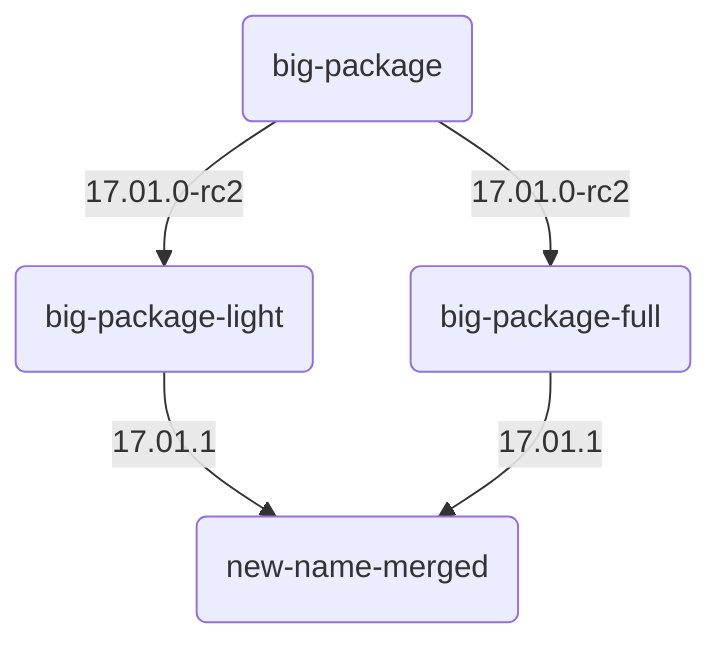

# replacement talbe

With new releases packages may be renamed. This can be due to changes contents, like after a split due 
This happens usually due to the following two reasons:

* A package grows overtime with more and more features. The new function may only be used by a small number of users and so the package is split in a <package>-full and a <package>-light version. The light version only contains the universal needed packages while the full version contains all extra features. The basic version is just enough for basic usage and will be installed as default on following releases.
* A package is renamed to adapt to new renaming policies. An illustration is the 'luaneightbl' package which has been renamed to 'luci-lib-luaneightbl'.

It is crucial that after an update all before installed packages are still in place. An possible approach to adapt to new package names is of having a replacement table as in MeshKit [^meshkit_rt]. The algorithm checks installed packages of the currently installed release, renames the packages based on the replacement table and creates a new image. 
The MeshKit approach is rather static and a more flexible way could come in handy. The current idea is to offer a file based renaming table which could be easily used as a Git repository and managed by the community via pull requests. 

To let the update server support different distributions a folder namend after the distribution is created. 

    lede/
    libremesh/

All distributions have a single file namend `releases` that contain all releases in order of appearence. In the following example based on *LEDE* releases.

    # ./lede/releases
    17.01.0
    17.01.0-rc1
    17.01.0-rc2
    17.01.1
    
    
Within the folder `replacements/` are files based on release names. To make the file easy human readable the `json` format may be a good choice. The content of a file could look like this:

    # ./lede/replacements/17.01.1
    {
        "bigpackage": [
             "bigpackage-light": [
                 "default": true
             ],
             "bigpackage-full": [
                 "installed": "the-missing-extra-feature"
             ]
      
        ],
        "outdate-package": None
        "merged-packge-1": "merged-package"
        "merged-package-2": None
    }
    
    
The update server will receive the currently installed version of the router and iterate over all releases until the newst version. It is possible that a package is renamed a couple of times during this process. 

### Splits

When a packge is splitted there need to be extra rules to decide which packgae will be installed. This can be a problem if a package is merged in a new release and a extra package had to be installed before. 
A possible solution is to create a simple dependencie tree. 

#### footnotes
[^meshkit_rt]: https://github.com/freifunk/meshkit/blob/64e99f4d2f7f4f99bb94a9f47bdff9180bf51155/controllers/default.py#L666

